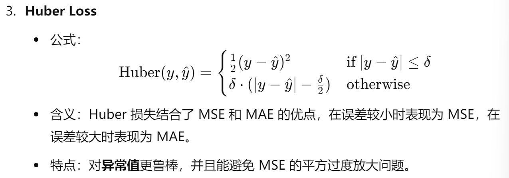
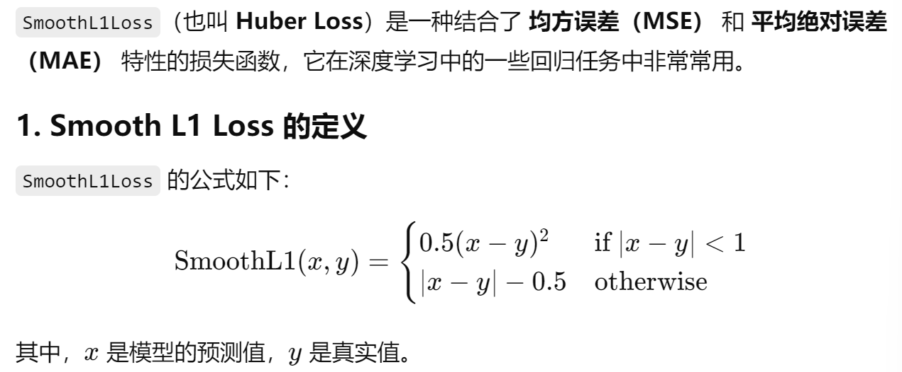

## 重要概念

##### **1、监督学习与无监督学习的区别**

- 监督学习：
  - 数据集特征：有输入的特征和对应的标签
  - 目的：学习如何预测标签
  - 示例：回归问题和分类问题
- 无监督学习：
  - 数据集特征：只有特征，没有标签
  - 目的：通过数据中的特征，自己发现数据中的模式或结构，模型寻找数据的隐藏结构或分组
  - 示例：聚类问题

##### **2、机器学习和深度学习的区别**

- 机器学习：
  - 概念：人工智能的一个子领域。目标是通过数据训练模型，从数据中学习规律，并对新数据进行预测。
  - 提取特征：常用到特征工程，<u>手动选择并提取数据的关键特征</u>
  - 模型复杂性：模型较简单，如线性回归等。训练时间短。
  - 模型解释性：传统机器学习模型通常更具解释性。例如，线性回归模型可以通过权重解释每个特征对输出的影响
- 深度学习：
  - 概念：机器学习的一个子领域。专注于使用神经网络，尤其是多层神经网络。主要用于非结构化数据。
  - 提取特征：深度学习模型能<u>自动从数据中学习特征</u>，不需要人工特征提取。适合处理复杂和高纬的数据。
  - 模型复杂性：模型非常复杂，通常有多个神经网络组成的深层模型，每一层学习数据的不同抽象。训练时间长，需要大量数据和高计算能力（GPU)
  - 模型解释性：深度学习模型通常被视为“黑箱”，即使模型表现很好，但很难解释每个神经元的具体作用和模型的决策过程。

##### **3、偏导数、链式法则、梯度、矩阵等数学概念在机器学习中的作用**

- **偏导数**：偏导数用于计算损失函数对模型参数（如权重和偏置）的变化率。在优化器里使用的，用来更新参数。偏导数在梯度下降算法中非常重要，梯度就是由偏导数组成的向量。
- **链式法则**：在深度学习中，神经网络通常由多层非线性函数组成，我们需要使用链式法则将每一层的导数传递到前一层。在反向传播中用到，计算每一步的导数，用来最后求得损失函数对参数的偏导。这对于梯度下降至关重要，因为它使我们能够通过反向传播快速计算模型的梯度，从而更新参数。
- **梯度：**梯度就是由偏导数组成的向量，用于指示如何调整模型参数以最小化损失函数。在机器学习中，梯度用于指示损失函数的最陡下降方向，从而帮助我们更新模型的参数，使得损失函数最小化。梯度下降是一种用于优化模型参数的核心算法。通过计算损失函数相对于模型参数的梯度，我们可以知道如何调整参数，以使损失函数的值尽量小。

- **矩阵：**矩阵是机器学习和深度学习中的一种基本数据结构，用于表示和操作数据、权重、激活值等。矩阵运算是机器学习中计算的核心，尤其在处理多维数据和模型参数时，使用矩阵能够提高运算的效率。

##### **4、常见的激活函数**

sigmoid:二分类问题

softmax:多分类问题

Tanh:循环神经网络RNN中

relu:卷积神经网络CNN，回归问题（全连接层后面）

激活函数是神经网络中决定节点输出的函数。它引入了非线性，使网络能够拟合复杂的函数和数据。常见的激活函数包括：

**(1) Sigmoid 函数**

- **定义**: 
  $$
  Sigmoid(x)= \frac{1}{1 + e^{-x}}
  $$
  
- 特点：

  - 输出值在 0 和 1 之间。
  - 用于**二分类问题**或输出层，但不推荐用于深层网络，因为其导数容易饱和，导致梯度消失。

- **优点**: 简单、平滑。

- **缺点**: 梯度消失问题，导致模型训练变慢。

  为什么容易梯度消失？可以结合图来看，非常的平滑，有些地方求导就=0了

**(2) Tanh 函数**

- **定义**: 
  $$
  Tanh(x)= \frac{2}{1 + e^{-2x}} - 1
  $$
  
- 特点:

  - 输出在 −1和 1 之间。
  - 改善了梯度消失问题，常用于**循环神经网络（RNN）**中。

- **优点**: 比 Sigmoid 更适合处理数据。（为什么更适合处理数据？）

- **缺点**: 仍存在梯度消失问题。

**(3) ReLU（Rectified Linear Unit）**

- **定义**: 
  $$
  ReLU(x) = \max(0, x)
  $$
  小于0的时候为0，大于0的时候=x
  
- 特点:

  - 输出非负，激活函数不会饱和。
  - 广泛用于深层神经网络中，尤其在**卷积神经网络（CNN）**中。

- **优点**: 计算简单，解决了梯度消失问题。

- **缺点**: **“死神经元”问题**，即当神经元的输出总是 0 时，参数不再更新。

**(4) Softmax 函数**

- **定义**: 
  $$
  Softmax(xi)= \frac{e^{x_i}}{\sum_{j} e^{x_j}}
  $$

- 特点:

  - 用于**多分类问题**的输出层，将输出转化为概率分布。

- **优点**: 将输出值归一化，使得它们可以被解释为概率。

- **缺点**: 仅适合多分类任务。

##### **5、神经网络的基本结构**

神经网络的基本结构由输入层、隐藏层和输出层三部分组成：

- 输入层 ：接收输入数据，每个节点对应输入数据中的一个特征。输入的维度等于数据的特征数量。

- 隐藏层

  - 功能: 隐藏层进行特征转换和学习，是神经网络中最关键的部分。通过维度转换，提取不同的特征（更高维度的特征）进行学习。每一层通过非线性激活函数来提取数据的复杂模式。
  - 特征: 可以包含多个隐藏层，每一层由多个神经元组成。
  
- 输出层：生成最终的预测结果。输出层的节点数量取决于具体任务（回归、二分类、多分类）。 对于回归问题，输出层通常只有一个节点；对于分类问题，输出层的节点数等于类别数。

- 神经元：每个神经元接收来自前一层所有节点的输入，计算加权和，并通过激活函数产生输出。

  - 公式: 

  $$
  y=f(\sum_{i} w_i x_i + b)
  $$

  - 其中w是权重，x是输入，b是偏置，f是激活函数（在代码里，是怎么进行计算加权和的？为什么直观上只是把输出的内容给下一个函数？）

##### **6、机器学习中的数据处理**

**(1) 数据清洗**

- 处理缺失值：可以通过填补、删除或插值处理数据中的缺失值。
  - 均值填充：用特征的均值填充缺失值。
  - 中位数填充：对于含异常值的数据，用中位数更可靠。
  - 插值法：根据时间序列或趋势预测填补缺失值。
- 处理异常值：去除或处理数据中偏离大多数数据点的异常值。
  - Z-score 方法：计算 Z 值，去除 Z 大于某个阈值的数据。

**(2) 数据标准化与归一化**

- 标准化: 使数据具有相同的尺度，通常会将特征转换为均值为 0，标准差为 1 的分布。

  公式: 
  $$
  z= \frac{x - \mu}{\sigma}
  $$
   其中 μ是均值，σ是标准差。

- 归一化: 将数据缩放到特定范围（通常为 0 到 1），适合距离度量敏感的算法（如 K 近邻）。

  公式:
  $$
  x′= \frac{x - x_{\text{min}}}{x_{\text{max}} - x_{\text{min}}}
  $$
  

**(3) 特征工程**（未使用过，还需继续学习）

- 特征选择: 通过相关性分析、重要性排序、PCA 等方法选择对模型有用的特征，减少维度，提升模型的效果和计算效率。
  - 过滤法：通过统计方法如相关性、方差分析等选择特征。
  - 包装法：如递归特征消除（RFE）通过逐步训练模型来筛选特征。
- 特征提取: 将原始特征组合或转换为新的特征，从而更好地表达数据。
  - 主成分分析（PCA）：将高维数据降维，提取主要的特征。
  - LDA（线性判别分析）：用于分类问题中的降维。

**(4) 数据集划分**

- 训练集: 用于训练模型，通常占总数据集的 60%-80%。
- 验证集: 用于调优模型参数，监控模型在训练中的表现。参与训练（多次）。可以进行早停机制和保存最佳模型。
- 测试集: 用于评估模型的泛化能力，通常在最后进行评估。一般只进行一次测试。

##### 8、什么是梯度消失？

它描述了在进行反向传播算法时，神经网络中较早的层（离输出层较远的层）的梯度逐渐变小，甚至接近于零，使得这些层的参数几乎无法更新。

原因：梯度消失通常发生在使用激活函数（如sigmoid和tanh）时，对于激活函数如 `sigmoid` 或 `tanh`，它们的导数在数值上是有限的。当这些激活函数的输入处于很大或很小的值时，它们的导数非常接近于零。在反向传播中，我们计算每一层的梯度时，会把每一层的梯度相乘。

**9、什么是MLP？**MLP和transformer里的前馈神经网络的关系？MLP和全连接层的关系？这种神经网络的作用是什么？

- 三者关系：**MLP**是一种经典的前馈神经网络结构，包含多个层次的全连接层
- FFN 前馈神经网络实质上就是一个两层的 MLP
- MLP是多层感知机，是最基础的神经网络结构之一。是一种前馈神经网络，它由至少一个输入层、一个或多个隐藏层、以及一个输出层组成。（原来就是我最开始写的那种网络结构啊啊）一般是一个线性层+一个激活函数+一个线性层

- 随着深度学习的发展，MLP 逐渐被这些更复杂的网络所取代，但它依然是神经网络基础原理的经典示例，许多更复杂的网络也是基于 MLP 的思想发展而来的。

##### 10、什么是自注意力机制？什么是自回归模型？

**自注意力机制**是深度学习模型中的一种方法，用于衡量序列中不同元素之间的相关性。最早被广泛应用于 `Transformer` 模型中，它解决了长距离依赖的问题，使得模型在处理长序列时，能够捕捉到序列中任意两个元素之间的关系。最后生成上下文向量。

**自回归模型**是一类根据序列的过去值来预测未来值的模型。在自然语言处理（NLP）中，它被广泛用于生成任务，如文本生成、语言建模等。自回归模型的核心思想是使用已知的序列前缀来预测当前或未来的值。

在语言建模中，自回归模型通过估计一个条件概率分布来生成下一个单词：
$$
P(x1,x2,…,xn) = \prod_{t=1}^n P(x_t \mid x_1, x_2, \ldots, x_{t-1})
$$
可以说自注意力机制是对自回归模型的改进？？因为自回归模型不能有长距离的依赖，不能并行处理，只是通过前面的词来预测下一个词？

应该是各自分工不同？自注意力机制不是用来预测下一个词的，而是找出每个词之间的依赖关系的。

**可以在自回归模型中 使用自注意机制**：预测未来值的任务是通过自回归模型整体的结构来完成的，自注意力机制在其中起到的作用是提供丰富的上下文信息。

## 常见的损失函数的学习

1、**均方误差 (Mean Squared Error, MSE)**:回归问题
$$
MSE=\frac{1}{n} \sum_{i=1}^{n} (y_i - \hat{y}_i)^2
$$
衡量预测值与实际值之间的差异，误差越大，MSE 越高。

2、**均方根误差 (Root Mean Squared Error, RMSE)**:回归问题
$$
RMSE= \sqrt{\frac{1}{n} \sum_{i=1}^{n} (y_i - \hat{y}_i)^2}
$$

其中，δ 是一个阈值，通常是用户指定的超参数。

4、原来就是我用过的SmoothL1Loos

`SmoothL1Loss` 是 Huber Loss 的特例，通常在实现时，δ默认设置为 1

当预测误差 ∣x−y∣|x - y|∣x−y∣ **小于 1** 时，`SmoothL1Loss` 的计算方式与 **均方误差（MSE）** 类似，使用的是平方项。这个部分使得它在误差较小时对模型有更平滑的惩罚。

当预测误差 ∣x−y∣|x - y|∣x−y∣ **大于等于 1** 时，它的计算方式与 **绝对误差（MAE）** 类似，使用的是线性项。这个部分使得它在误差较大时对模型的惩罚更加温和。

5、交叉熵损失（Cross-Entropy Loss）：分类问题

**二分类交叉熵损失**：（很重要）

- 公式：
  $$
  Binary Cross-Entropy = -\frac{1}{n} \sum_{i=1}^n [y_i \log(\hat{y}_i) + (1 - y_i) \log(1 - \hat{y}_i)]
  $$
  含义：用于**二分类**任务，计算预测概率与真实标签之间的距离。

**多分类交叉熵损失**：（也很重要）

- 公式：
  $$
  Categorical Cross-Entropy= -\sum_{i=1}^n \sum_{j=1}^k y_{ij} \log(\hat{y}_{ij})
  $$
  

  

特点：交叉熵损失会使模型倾向于最大化预测类别的概率，适用于分类任务。

## 常见优化器的学习

1、**随机梯度下降（SGD, Stochastic Gradient Descent）**：

- 每次只用一个样本计算梯度并更新参数。
- 优点：内存占用少，能快速更新参数。
- 缺点：更新过程不稳定，损失函数震荡大。

**2、自适应学习率优化器（Adam)**

根据参数的历史梯度大小调整每个参数的学习率，适应性地为每个参数分配不同的学习率。

引入了指数加权移动平均（EMA）

优点：通常是默认的选择，适用于大多数深度学习任务。

缺点：可能在某些任务上表现不如 SGD。

参数：学习率（α）、一阶动量 β1（通常为 0.9）、二阶动量 β2通常为 0.999）。

以上内容是重点知识的记录，详细学习笔记（仅用于个人学习）见https://uestc.feishu.cn/docx/DLzodhudBoMzlSxOqDZcnUpOneb?from=from_copylink