题目中的问题作答：

**1、计算机采用什么数据结构存储、处理图像？**

- 存储图像：
  - 灰度图像：灰度图像是二维矩阵，矩阵中的每个元素表示一个像素的灰度值（通常为0到255之间的整数，8-bit）。
  - 彩色图像（RGB）：彩色图像是三维矩阵，通常有三层，每一层分别表示图像的红色（R）、绿色（G）、蓝色（B）通道的强度值。
  - 还搜到了一种方式是用矢量来存储，大概意思好像是给出图像的各个特征（长宽高颜色等），每次读取都是重现画图
- 处理图像：图像通常以多维数组（tensor）的形式表示

**2、如何设计一个神经网络？一个神经网络通常包括哪些部分？**

- 设计神经网络时，需要根据任务和数据特征来选择合适的结构
- 一个神经网络通常包含三部分：
  - 输入层：输入的数据需要是提前处理好的数据，一般是张量（多维数组）
  - 隐藏层：通常有全连接层，卷积层，池化层，激活函数层
  - 输出层：不同问题的输出层有不同的神经元数量

**3、什么是欠拟合？什么是过拟合？**

- 欠拟合：

  - 定义：欠拟合是指模型在训练数据和测试数据上都表现不佳，无法有效捕捉数据的模式。
  - 原因：通常是因为模型过于简单，无法学习到足够的数据特征。比如模型参数太少，或者训练不充分。

- 过拟合：

  - 定义：过拟合是指模型在训练数据上表现得很好，但在测试数据上表现较差。模型过度拟合了训练集中的噪声和细节，导致泛化能力下降。

  - 原因：模型过于复杂，拟合了训练数据中的噪声或偶然模式，而这些模式并不适用于测试集。

    

## 代码实现思路

#### **神经网络整体设计思路：**

为了直观显示设计的神经网络，我制作了一个图，以下是我的设计思路。

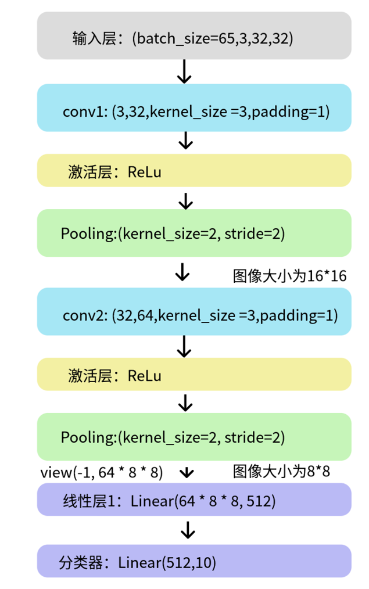

- 神经网络设计需要三个层，输入层，隐藏层和输出层（图像分类问题的输出层就是最后的分类器，本质是一个线性层）。
- 对于图像分类问题的隐藏层通常需要：卷积层（用于放大特征），激活函数（用于增加非线性）和池化层（用于提取特征）。
- 最初的设计思路是：做一个简单模型设计，把以上的三层用了两次，第一次用来提取低层次特征，第二次用来提取高层次特征。因为最后的64*8 * 8的数额太大，所以增加了一个线性层。

#### **神经网络局部设计思路（参数的选取）**：

**1、输入层（batch_size=64)：**

-  最初选择64是根据经验，发现其他训练模型里大多选择64.

- 专业解释为batch_size的选择涉及到计算效率、内存使用和模型收敛速度等。`batch_size=64` 通常适合绝大部分硬件配置，能够有效利用GPU的并行能力，提高训练速度。
  - `batch_size`过小： 可能导致模型的梯度更新过于噪声化，训练不稳定，可能导致损失曲线波动较大，收敛较慢；
  - `batch_size` 过大：会导致模型需要更多内存，减少迭代次数，可能会影响模型的泛化能力，可能导致收敛速度慢，或者训练中模型对训练集过拟合。

**2、conv1第一个卷积层(3, 32, kernel_size=3, padding=1):**

- 通道数32：卷积层用于特征提取，前几层的通道数要设计小一些用来提取线条，边缘等低层次特征，所以设计第一个卷积层数为32（2的次方数中相对较小的）。
- 3x3卷积核：3 * 3卷积核可以在图片的局部区域内捕获细微的特征（经验，大家都用3*3的）。最后是在卷积层一般不缩小图像尺寸，所以要设定以下padding（根据3 * 3算来的1）

**3、最大池化层（kernel_size=2, stride=2)：**

 `kernel_size=2, stride=2` 降维率为 50%，属于一个始终的范围， 能平滑过渡，适合大多任务。

**4、全连接层 nn.Linear(64 * 8 * 8, 512)  ：**

64*8 *8是 有64个通道，每个图片大小是8 * 8

选取512的依据：最初选择是依据经验，前面的数太大，需要一个中间数来过渡一下。

专业解释：512 作为一种常见的中间特征维度，能够在降低特征维度的同时，保留充分的特征信息用于后续的分类任务。如果直接将 4096 维特征压缩到一个非常小的数值（比如 128 或 256），可能会丢失过多信息，导致模型表达能力不足。如果是更复杂的任务（，通常会选择更大的全连接层尺寸。

#### 损失函数和优化器设计思路

**损失函数：**

- 选择思路：本题选择的是交叉觞函数。因为我了解到的损失函数只有两个，交叉觞函数和均方误差函数，而均方误差函数适合线性回归问题，交叉觞函数适合于多分类问题。
- 专业解释：我一开始不太明白，就是我在学习分类任务的课时最后需要用一个softmax函数来把模型输出转化为概率分布，为什么在设计神经网络的时候不用设计这一层？后来查询原因是`CrossEntropyLoss` 内部包含了 `softmax` 函数（将模型输出转换为概率分布）和 `log` 函数（取对数以计算交叉熵）这意味着不需要手动处理这些步骤，简化了代码。这个也是选择交叉觞损失的一个好处。

**优化器选择：**

- 选择思路：选择的是学习率为0.001的Adam。用过的优化器只有SGD和Adam,差别没有过多了解。这里使用的是Adam,因为它是结合了两种优化方法，感觉可能更好一点。经查询可能会造成过拟合，所以会在接下来的调参中进行调整。
- 专业解释：Adam 结合了动量和自适应学习率的优势，可以加速模型的收敛，特别是在像图像分类任务中，Adam 可以让模型较快收敛到一个较好的结果。Adam 的自适应学习率机制使得它能动态调整每个参数的学习率，这在复杂模型中尤为重要，因为不同参数的梯度大小可能差异很大。

## 进阶要求（代码改进）

#### 第一次可视化出现的问题：

**问题**：原本的代码中设定只有10次训练次数，为什么这里出现了这么多？

**原因**：把`train_losses.append(loss.item())`   这个记录训练损失的代码加在了内层循环内，使得每训练一批数据，就会增加一条损失，也就是会增加 （50000/64）*10=7820次

**解决方案**：把`train_losses.append(loss.item())`放在外层循环，就会epoch变成10次

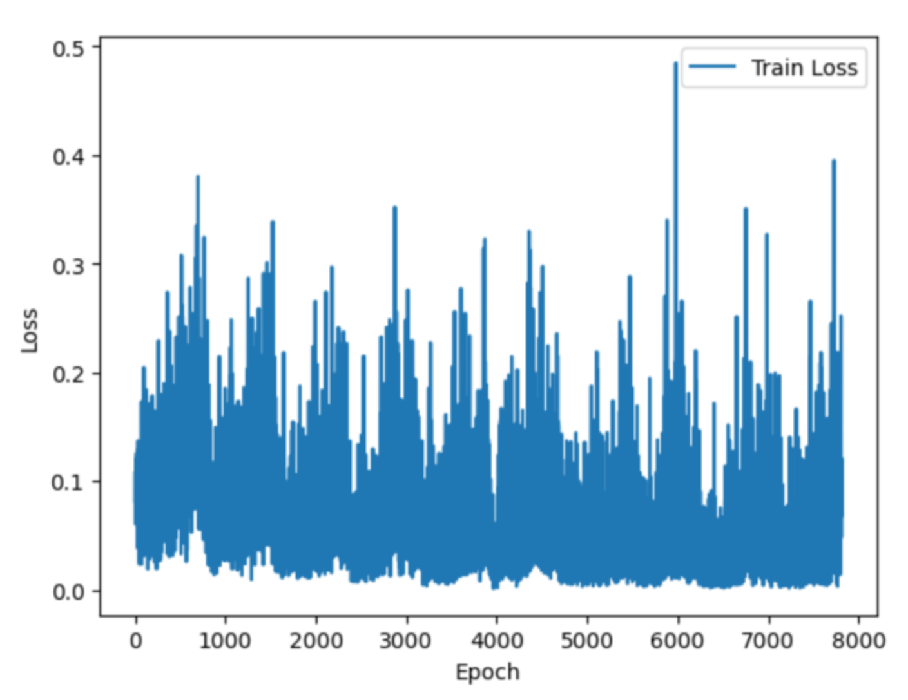

#### 初始模型训练结果：

**初始出现的情况**：波动大，最后损失很小，过拟合

**问chatgpt的可能的原因**：过拟合，学习率过大，训练次数不足

**我想进行的改进**：先来个简单的，把学习率改为0.0001（训练次数在原始代码中规定的10次，这能改吗？）

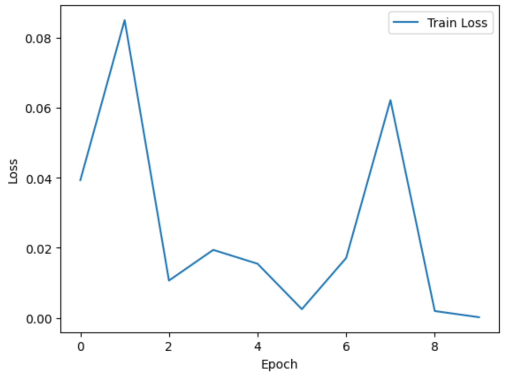

#### 第一次改进后结果：

**改进**：学习率为0.0001

**问题**：准确率不高，数据波动性明显。其他问题，我原本是也想画测试集的损失变化图，但是原本代码中，测试集只训练了一轮

**我认为可能的原因**：数据波动明显是因为训练过程是按批进行的，每一批会有所不同，但整体呈下降趋势是还是可以的，至于明显，我觉得可能是因为训练次数太少。 准确率不高...尝试使用一些其他的优化器吧

**改进措施**：增加训练次数到100轮（后期验证时间太长），改用SGD优化器（后期验证效果不佳），，也把测试集训练100轮（后期验证错误）

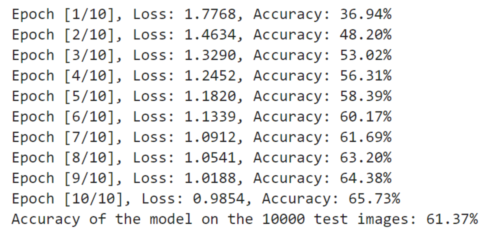

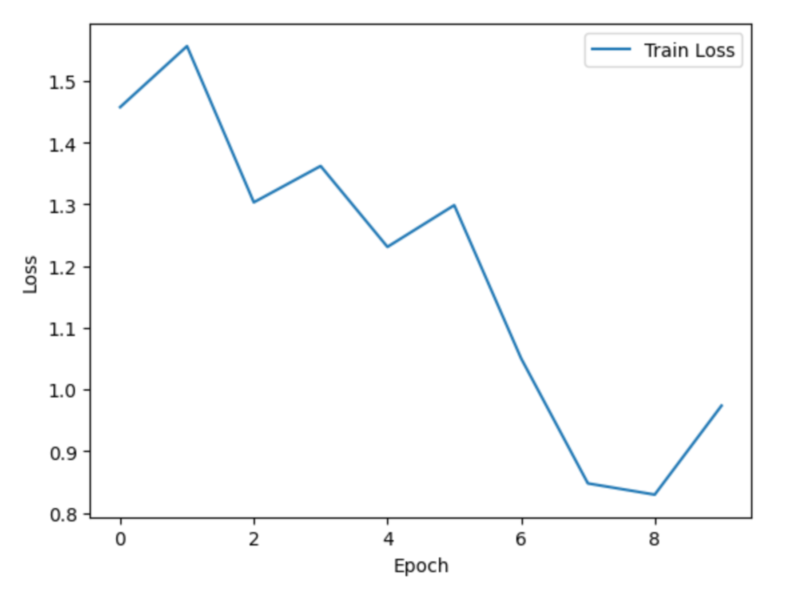

#### 第二次改进后结果：

**改进**：增加了训练轮数

**问题**：随着训练轮数增加，准确率提高了很多，但是怎么波动性还是这么大？并且训练集和测试集准确率差的太多了。

**chatgpt给出的原因**：过拟合，学习率太高（0.0001的学习率还不够低吗）

**改进措施**：由于训练速度较慢，决定把训练轮数定为30次。

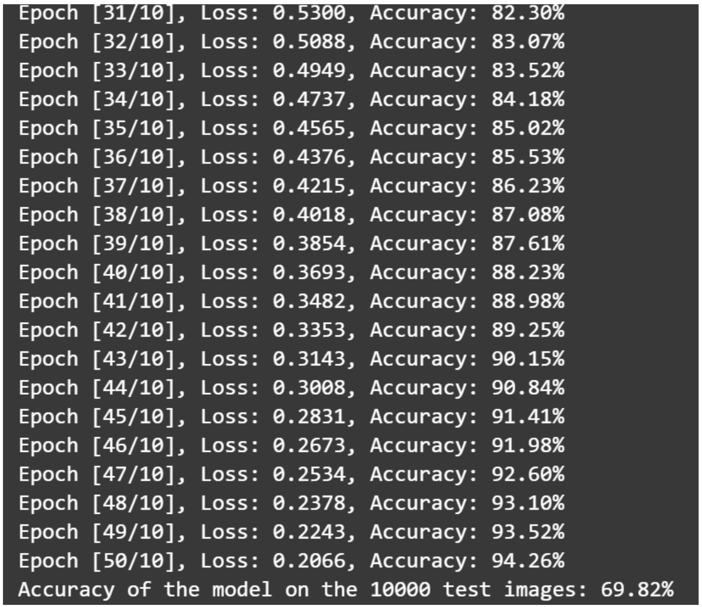

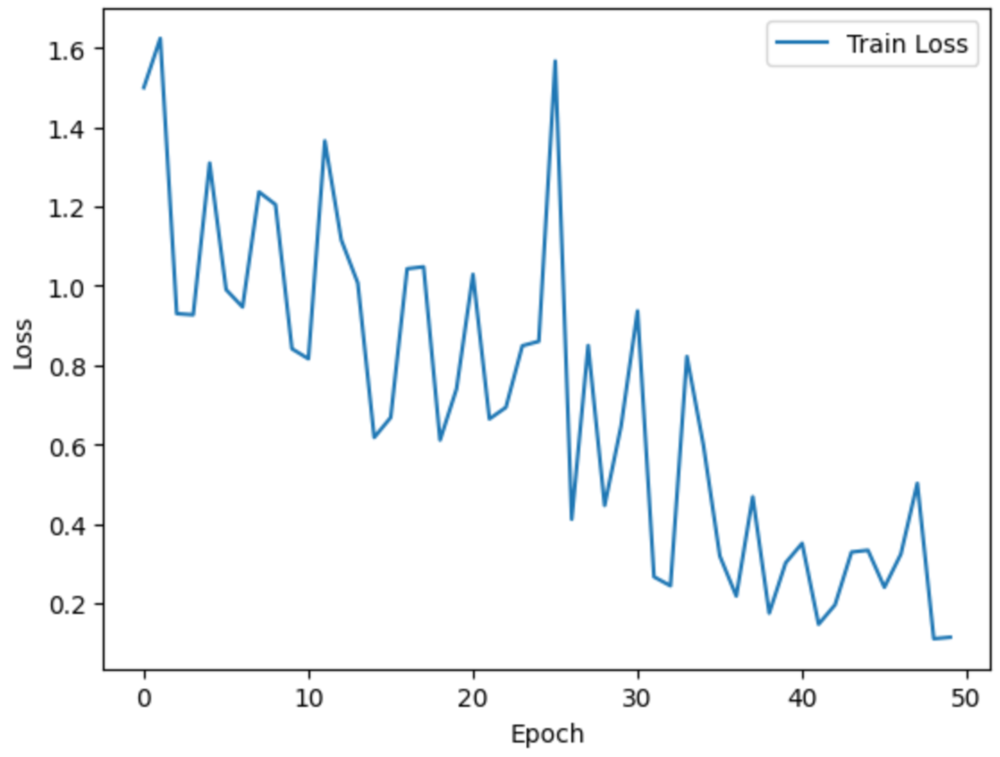

#### 第三次改进结果：

**经询问**：损失整体下降是很好的，有波动是正常的

**我认为**：由于测试集只测试了一次，可能差别较大，决定将测试集也测试30轮

**询问chatgpt:**测试集测试多轮是错误的，测试阶段的主要目的是评估模型在测试数据上的性能，而不是像训练那样进行多次迭代。通常，测试集只需要迭代 **一次**，每次运行结束后输出模型的准确率和损失。

**遇到一个问题：**啥也没改，莫名准确率高了这么多

猜想：难道是因为，我一遍一遍的运行，它的测试次数是累计的？也就是一遍30次，我运行了5遍，就变成了训练了150次？

答案：确实是累计的，由于运行了好多次，以至于模型已经接近完全拟合了...

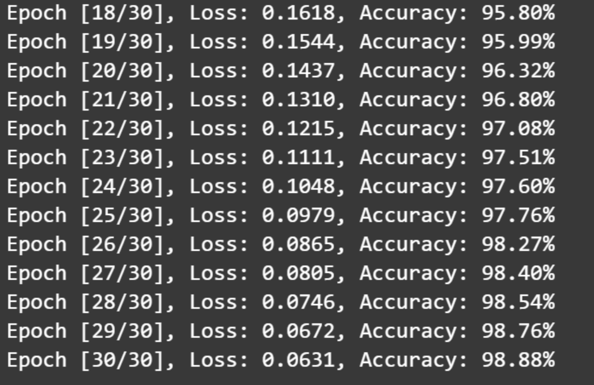

#### 第四次改进结果：

第三次相当于没有改进，但是出现了很多问题。由于上述模型已经过拟合，所以我知道了每次运行要从头开始。

**改进**：尝试了学习率为0.0001的SGD优化器，结果更差劲

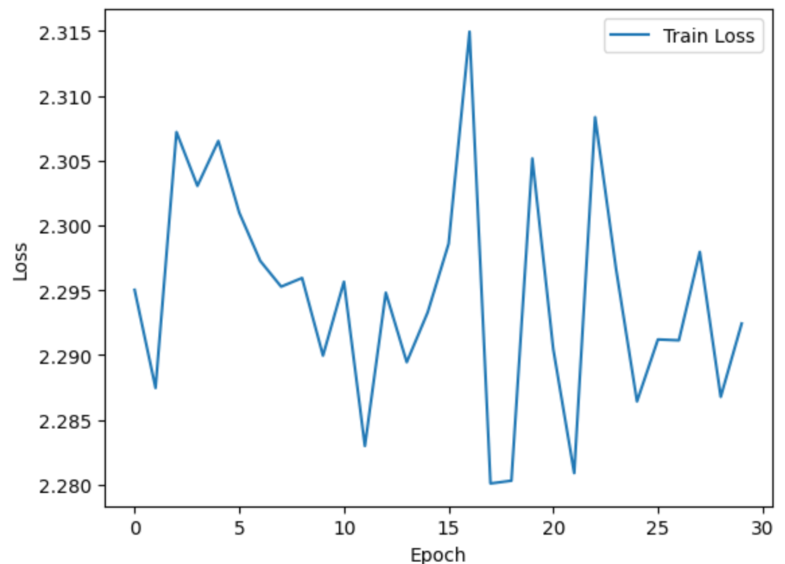

**改进**：重新运行了Adam的优化器的代码

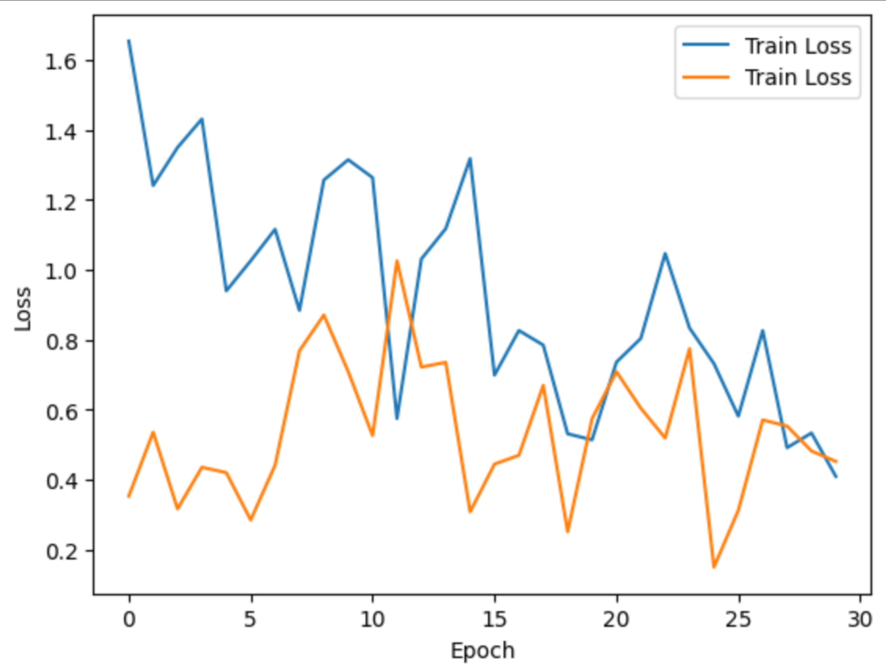

#### 第五次改进结果：

**吸取以上错误经验，最终决定：**

学习率0.0001  ；优化器Adam;训练轮数30；神经网络的卷积层改为3层，全连接层改为3层；测试只测试一次（因为测试多了没啥用）

训练效果：差距缩小

**一个问题：**学习率过小可能会出现收敛速度慢，尝试使用学习率调度器

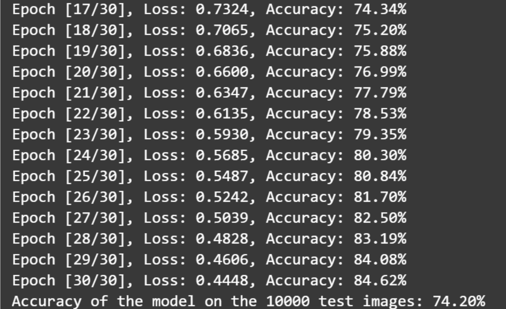

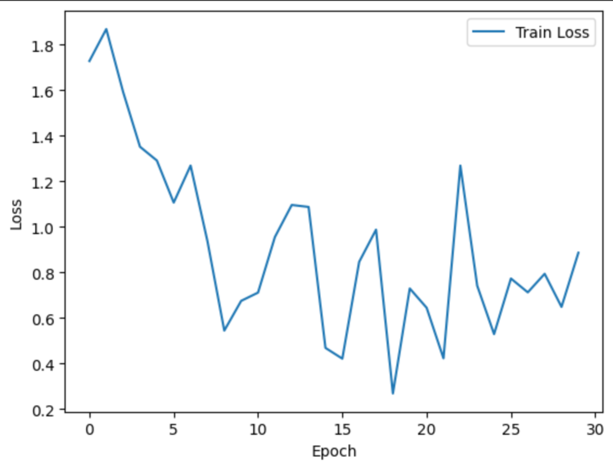

**改进措施：**初始学习率设置为0.01，并增加学习率调度器

发现：过拟合了......

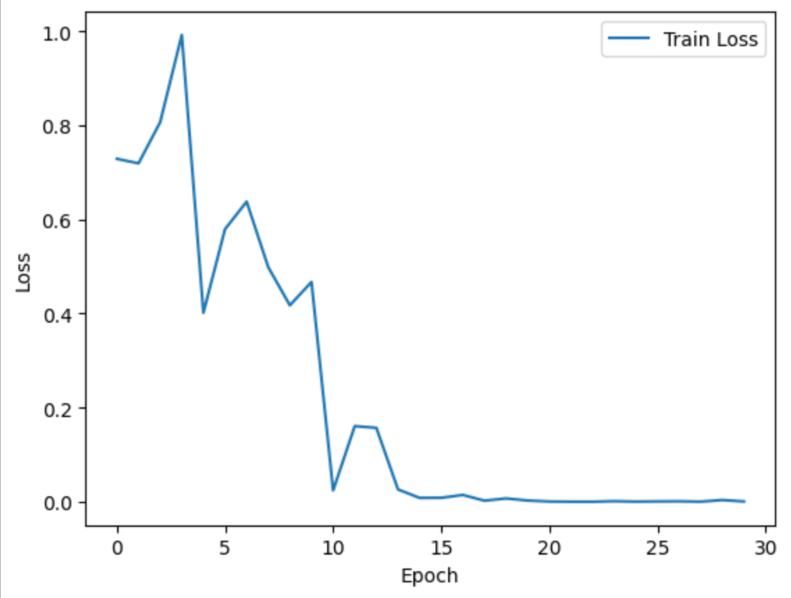