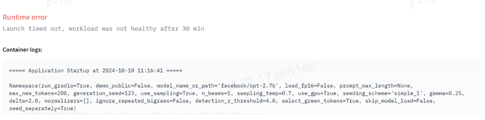

Github链接https://github.com/Baixiaochi9449/jotangzhaoxin.git

基础知识:

**1、logits是什么？softmax函数是什么？**

**Logits**是神经网络最后一层的输出（在softmax之前的数值）。它们是用于预测的原始分数，通常通过某种激活函数（如softmax）转化为概率。

- 对于分类任务，神经网络的最后一层通常会输出一个向量，每个元素对应一个类别的得分，这些就是logits。
- Logits并不直接表示概率值，而是用于进一步计算概率。

**Softmax函数**是一种激活函数，它可以将一个实数向量转化为概率分布。它将每个元素的指数值归一化，使得所有元素的总和为1。

如果logits是 `[2.0, 0.5, -1.2]`，那么softmax会将它们转化为类似 `[0.78, 0.18, 0.04]` 的概率值。模型就可以根据这些概率值来决定预测的类别。

**2、Attention机制**

- Attention机制是深度学习模型中的一种方法，它可以让模型在处理输入时，根据某些权重来关注输入的不同部分。Attention机制最早在机器翻译中提出，现在广泛用于自然语言处理、计算机视觉等领域。

- 核心思想：Attention机制的核心是输入序列中的每个元素根据其重要性被赋予一个权重，这些权重决定了模型应该更加关注哪些部分。

- 计算过程：
  - **Query, Key, Value**：Attention机制通常涉及三个向量——Query (Q）、Key (K)和Value (V)。
  
  - **计算注意力权重**：
    1. 通过Query和Key计算出每个输入之间的相似度。
    2. 利用softmax将相似度归一化为权重。
    
  - **加权求和**：将Value乘以这些权重，得到最终的加权求和输出。
  
    

**3、Transformer**

Transformer模型由n个编码器（Encoder）和n个解码器（Decoder）两部分组成：

- **编码器**：将输入序列编码成一个向量表示。每个编码器层包括多头自注意力和前馈神经网络。在每一层之间有残差连接和层归一化。
- **解码器**：根据编码器生成的表示和已经生成的序列来生成输出序列。每个解码器层包含多头自注意力、跨注意力层和前馈神经网络。编码器和解码器之间的联系是，编码器输出的内容，输入给跨注意力层。（只有一个解码器 有跨注意力层吗？）

**4、LLM 基本架构**

LLM（大型语言模型）通常基于Transformer架构，通过大量的文本数据进行训练，具备了强大的自然语言理解和生成能力。

架构特点：

- 大规模训练数据：LLM使用大量的文本数据进行预训练，能够捕捉广泛的语义知识。
- 深度和宽度：LLM通常具有数百甚至上千层的Transformer层，模型参数数量巨大。
- 自监督学习：通过自监督学习方法，LLM在训练时无需人工标注数据。最常见的自监督任务是语言建模，即预测给定上下文的下一个词。

**自回归模型：**

自回归模型（Autoregressive Model, AR）是一类用于时间序列数据的模型，它假设当前时刻的数据可以通过之前时刻的数据进行线性预测。也就是说，当前数据点是之前数据点的加权组合，再加上一些噪声。

# Task4.1   论文阅读

## Abstract

**要做什么:**大型语言模型的潜在危害可以通过水印模型输出来缓解，即在生成的文本中嵌入对人类隐形但算法可以检测到的信号。我们为专有语言模型提出了一个水印框架。

**特点：**该水印以不影响文本质量的方式嵌入，并且可以在不访问语言模型 API 或参数的情况下使用高效的开源算法进行检测。

**实现方法：**水印通过在单词生成之前选择一组随机“绿色”标记，然后在采样期间软性地推广使用绿色标记来实现。

**分析灵敏度方法：**我们提出了一种统计测试方法，用于以可解释的 p 值检测水印，并推导出一种信息论框架，用于分析水印的灵敏度。

## 1 Introduction

### 1.1 符号与语言模型基础

**本段讲述了语言模型如何生成文本的过程：**

1. 词汇表：语言模型有一个“**词汇表（Vocabulary）**”，里面包含了各种单词或单词片段，称为“**tokens**”
2. prompt：想象你给AI系统一个开头（prompt），就像是你和AI说：“从这里开始继续说下去”。**prompt** 是给定的起始内容，相当于引导AI的输入。**s(t)** 表示时间t时生成的token，是模型每一步生成的单词或单词片段。
3. 语言模型工作原理：
   1. 语言模型（LM）是一个函数（通常由神经网络来实现），用于预测下一个token。
   2. 它需要知道一些前面的内容，包括prompt和之前生成的内容（比如s(-Np), s(-1), s(0), ..., s(t-1)）。
   3. 基于这些前面的内容，它输出一个向量，这个向量的长度和词汇表的大小一样（比如有50,000个元素）。
4. 向量转化为概率：这些logits不能直接被看作概率，需要经过一个叫**softmax**的函数转换成概率
5. 如何选择下一个token:模型生成的概率分布告诉我们每个词成为下一个词的可能性。接下来我们需要从中挑选一个。
   
   **挑选的方法**包括：
   
   - **随机采样**：模型按照概率的大小随机选择下一个词。（本论文中没有涉及随机采样）
   - **贪心解码/贪婪搜索**：模型直接选择概率最大的那个词。
   - **束搜索**：寻找全局最优解。模型不仅仅考虑单个最有可能的词，还同时考虑多个有潜力的词组合，选择最终得分最高的整个句子。

## 2 红色列表水印算法（硬水印）

算法1：**使用红色列表生成文本**

> **输入**：给定提示词（prompt），以及之前生成的序列。
>
> **循环生成每个新token**：
>
> 1. 使用语言模型对之前的token进行推理，得到每个词在词汇表中的概率分布。
> 2. 计算当前token序列的哈希值，使用这个哈希值作为随机数生成器的种子。
> 3. 使用生成的随机种子，将词汇表随机划分成“绿色列表”（green list）和“红色列表”（red list），两者大小**相等**。
> 4. 从绿色列表中采样下一个token，确保生成的token不出现在红色列表中。
>
> **结束**：重复这个过程直到生成完整的文本。

**也就是说**，这个方法的目的是给大模型生成的文字加水印，最后来检测水印。加水印就是不用红色列表中的词。检测水印就是 如果用了红色列表中的词，就是没加水印。

这种方法可以有效地将水印嵌入生成的文本中，并且检测过程不需要访问原始的模型或其API

**检测水印的关键**：自然生成的文本一半的词会无意中使用红色列表的词，但是水印处理的大模型就不用。

## 3 更复杂的水印——软水印

**高熵：**高熵意味着选择的结果有很高的不确定性，也就是有很多可能的选项都看起来合理。例如，在生成一个单词时，模型认为有多个单词的概率相近，没有哪个特别突出。因为选项多且不确定性高，所以我们称之为高熵。比如，“I like to ____.”，填入“play”、“eat”、“read”等词都很合理，选项多，模型无法确定最优解，

**低熵：**低熵意味着系统的选择结果几乎是确定的，也就是只有一个或很少的选择是合理的。在这种情况下，不确定性非常小，因为几乎可以确定接下来该选什么。举个例子：在“Once upon a time, there was a ____.” 这种句子中，“princess”或“king”这样的词可能是特别合理的，而其他词可能性极低。

在大语言模型的文本生成和水印加密中，熵的概念非常重要。高熵时，水印能更容易地嵌入，而低熵时，水印的影响更小，能够保持生成内容的自然性。

**软水印的概念：**软水印并不像硬水印那样严格禁止生成红色列表中的词。它主要是在模型生成词的过程中，优先偏向于选择绿色列表中的词，但是不会完全排除红色列表的词

**优点**：在模型有很多选择时（也就是高熵的情况），软水印可以有效地嵌入水印信息；但在低熵的情况下，也就是只有很少或唯一的“最佳选择”时，它几乎不会影响结果。

**工作原理：**在软水印方法中，我们在绿色列表中的词的logits上加了一个小的常数δ。这个δ的存在使得这些词的概率稍微增加，更有可能被选中。

### 3.1 检测软水印

**检测硬水印的公式：**


这个公式用于统计检测生成的文本是否遵循绿色列表的比例，从而判断文本是否被加上了水印。通过计算得到的z值，可以进一步进行假设检验，来判断水印的存在。

我们假设没有水印（即“零假设”），然后计算绿色列表中的词数和期望值（T/2，即随机情况下绿色词的数量）。

如果z值大于4（检测的阈值），我们就认为水印存在。这个z值越高，零假设被拒绝的概率就越低（即说明检测出水印的可信度越高）。

### 3.2 红色软列表文本生成算法

> **输入**：
>
> - 提供一个提示（prompt）和之前生成的词（tokens）。
> - 输入一个**绿色列表**和一个**红色列表**，以及一个与硬度相关的参数 δ>0\delta > 0δ>0。
>
> **循环**（对于每个时间步 t=0,1,…t = 0, 1）：
>
> - **步骤1**：使用语言模型处理之前的词，并输出一个对词汇表的logit向量 l(t)
> - **步骤2**：计算当前生成的token s^(t−1) 的哈希值，并用它作为随机数生成器的种子。

以上和之前一样

> - **步骤3**：用这个随机数生成器将词汇表随机分成一个大小为 γ∣V∣的绿色列表和一个大小为 (1−γ)∣V∣ 的红色列表。

这里不平均分了，是按这样的比例去分红绿

> - **步骤4**：给每个绿色列表中的logit加上一个常数 δ。然后应用softmax操作，将这些修改后的logits转化为对词汇表的概率分布。
>
> 
>
> - **步骤5**：从水印概率分布中采样下一个token s^(t)。

**检测软水印的公式**


## 6 实验

**使用的模型**：opt -1.3B  

**类型-I 错误率：**即将人类文本误认为是水印文本的错误率

**类型-II 错误率：**即未能检测到已加水印文本的错误率

**数据集**：从 C4 数据集的新闻样式子集（Raffel 等人，2019）中随机抽取了文本。对于每个随机字符串，我们截取结尾的一部分 token 作为“基准”补全部分。其余的 token 则作为提示词。在实验中，使用了多种生成方式，如多项式采样（生成多种可能的文本）和贪婪/束搜索（挑选最有可能的文本）。

**PPL（困惑度）**：用来衡量语言模型好坏的指标，用于表示模型在预测下一个词时的不确定性或难度。值越低，表示模型越“困惑”越少，即预测越准确。

**人类基准的困惑度**：PPL越低，和人写的就越接近

**水印强度：**较小的绿色列表大小γ（gama）越小，较大的绿色列表偏置δ（delta）越大，可以为较短的序列实现非常强的水印。但是水印越强，文本质量越低。文本质量是PPL小的，即越接近人写的。

### **这个图展示了文本质量与水印强度之间的权衡**：

z-score是水印强度。一般δ（delta）取 2.0  -  5.0   ，γ（gama）在0.1 （最优解）效果较好。

选取下一个词：贪心搜索和束搜索混合


### 束搜索的影响：

**这个图展示了束搜索时水印强度与准确度之间的权衡**。束搜索与软水印具有协同作用。使用8个束时，效果最佳。整体呈直线，即使用不同的δ（delta）不会有PPL的变化。

**问题**：为什么不用分析γ（gama)?????可能跟束搜索的算法有关？？？

**答案**：图解给出：γ（gama)=0.5

选取下一个词：贪心搜索和束搜索（4和8的比较）混合。

束搜索提高了绿色列表的使用率，并且对模型质量（困惑度，PPL）的影响较小。


### 水印强度与tokens的数量之间的权衡

这里的token指的是？？？我认为时文本的长度，每次选一个token,所以tokens越来越长

要求水印的一类错误率和二类错误率随着序列长度T的增加而衰减到零。

**这张图显示了在 T 在 2 到 200 的范围内变化时，使用样本平均 z 分数衡量的水印强度**。

a b多项式采样，c 使用 8 路束搜索和 γ = .25。

我们再次看到束搜索实现高绿名单比率的力量；即使对于中等偏差 δ=2，只需 35 个标记就可以实现超过 5 的平均 z 分数。

不同的参数组合下，z-score随着token的数量上升而上升


**问题**：为什么要让绿色的表变小？？

**答案**：因为人类去写的话，红色会多很多；机器去写的话，绿色会更好；会有一个更大的区分

### 多元抽样的性能与敏感性。

在1%**FPR**下的ACC, **TPR,** **FNR**, **TNR**，F1 score

FPR+TNR=1    TNR+TPR=1

**FPR (False Positive Rate)**: 误报率，即没有水印却被误检为有水印的比例。

**TNR (True Negative Rate)**: 真负率，即正确识别为没有水印的比例。

**TPR (True Positive Rate)**: 真正率，即有水印时正确检测出的比例。

**FNR (False Negative Rate)**: 漏检率，即有水印却未被检测出的比例

多项式采样和束搜索（beam search）两种方法在水印检测中的表现和灵敏度的比较分析

图中展示了两种生成文本的方法：**多项式采样（图a）**和**8束束搜索（图b）**


**图c和图d展示了这两种方法的ROC曲线（受试者工作特征曲线）及其AUC（曲线下的面积）值，**用以评估水印检测的效果。图中还展示了对数尺度（semilog axes）下的表现。


请注意，在任何一次运行中都没有发现I型（假阳性）错误

表2提供了基于多项式采样和束搜索两种方法的水印检测的详细误差率


**实验结果总结**：

- 对于 δ=5.0的水印，束搜索可以实现接近100%的TPR（真阳性率），并且FPR（误报率）接近0，也就是水印检测效果最好。
- 对于更小的 δ 值（比如 δ=1.0），水印的检测效果较弱，可能会导致更多的漏检或误检。

**z-score 的作用**：

- z-score 用于衡量检测的灵敏度。较高的z-score意味着检测效果更好。
- 当水印的参数选择合适时，z-score值更高，表示检测水印的能力更强。

## 7 攻击水印

攻击水印：攻击者可以通过修改文本来绕过水印检测

**攻击模型假设**：假设攻击者通过结合私人水印模型和一些弱公开模型来生成没有水印的文本。这里主要关心的是那些在质量上跟原始模型生成的文本差不多的攻击。

**攻击类型**：

- **文本插入**：攻击者(我？）在生成的文本中插入额外的词。

因为这个额外的词可能存在红色列表中，就让文本更接近人写的

- **文本删除**：攻击者（我？）通过删除生成的文本中的部分词来逃避检测。

因为可能删除了很多绿色列表的词

- **文本替换**：攻击者（我？）替换生成的文本中的某些词，使得新的词可能不会触发检测

因为可能把绿色列表的词，替换为红色列表

**释义攻击（Paraphrasing Attacks）**：攻击者可以使用改写的方式来绕过水印，尤其是通过自动化的方式使用较弱的语言模型改写水印文本。

**离散修改（Discrete Alterations）**：攻击者可以通过添加空格、拼写错误等方式进行微小的修改，试图影响水印的检测。

？？检测词，为什么空格也有效？

**分词攻击（Tokenization Attacks）**：攻击者通过改变文本的分词方式，可能影响到后续生成的分词结果，从而改变文本中哪些词会落入“红色列表”或“绿色列表”。

**同形字攻击和零宽字符攻击（Homoglyph and Zero-Width Attacks）**：攻击者利用不同字符集之间的相似性，例如替换成不同的Unicode字符，来破坏水印规则。这种方法可以通过文本规范化来防御。

**生成攻击（Generative Attacks）**：利用大语言模型生成文本的能力，攻击者可以通过特定提示改变模型的输出方式，生成符合某种规则的文本，以此扰乱水印检测。例如，用Emoji来替换某些单词。

# Task4.2代码复现

源码[https://github.com/jwkirchenbauer/lm-watermarking](https://github.com/jwkirchenbauer/lm-watermarking?spm=5176.28575916.0.0.474f96d6EKNUU0)

“在1%FPR下的ACC, TPR, FNR, TNR，F1 score”

我没有看懂这个是哪里来的哎？？

为啥我最后生成的只是这样的Gradio页面？


为啥这个参数不对应呢？

以下是实现的具体过程：

### 环境配置：

1. 把im-watermaking 克隆到了本地
2. 在这个目录下 建了一个虚拟环境`python -m venv .env`

进入虚拟环境`.env\Scripts\activate`

1. 在虚拟环境下安装了 gradio  nltk  scipy  torch  transformers  tokenizers库（来自requirements.txt)

问题：虚拟环境是用来做什么的？我把什么安装在了虚拟环境？我为什么要用虚拟环境？我不用这个虚拟环境和用这个虚拟环境执行这个命令的区别是什么？

答：虚拟环境为了和全局环境区分开，如果两个环境下都下载了库，就会占用两个内存空间。因为可能不同项目使用的库的版本不同，所以配虚拟环境就可以分隔开来。

虚拟环境在`D:\Git\lm-watermarking\.env`

虚拟环境所在的库在`D:\Git\lm-watermarking\.env\Lib\site-packages`

### 运行代码（出现了一系列问题）

```Markdown
(.env) D:\Git\lm-watermarking>python app.py
Namespace(run_gradio=True, demo_public=False, model_name_or_path='facebook/opt-6.7b', load_fp16=False, prompt_max_length=None, max_new_tokens=200, generation_seed=123, use_sampling=True, n_beams=1, sampling_temp=0.7, use_gpu=True, seeding_scheme='simple_1', gamma=0.25, delta=2.0, normalizers=[], ignore_repeated_bigrams=False, detection_z_threshold=4.0, select_green_tokens=True, skip_model_load=False, seed_separately=True)
```

**max_new_tokens**: `200` 限制模型生成的新文本最多 200 个 token。

**generation_seed**: `123` 设置生成的随机种子，保证每次生成的结果一致。

```Markdown
(.env) D:\Git\lm-watermarking>python demo_watermark.py --model_name_or_path facebook/opt-6.7b
Namespace(run_gradio=True, demo_public=False, model_name_or_path='facebook/opt-6.7b', prompt_max_length=None, max_new_tokens=200, generation_seed=123, use_sampling=True, sampling_temp=0.7, n_beams=1, use_gpu=True, seeding_scheme='simple_1', gamma=0.25, delta=2.0, normalizers='', ignore_repeated_bigrams=False, detection_z_threshold=4.0, select_green_tokens=True, skip_model_load=False, seed_separately=True, load_fp16=False)
```

#### 问题和解决：

**有个问题，运行app.py并没有启动gradio?????**

##### 方案一

我检查了防火墙，端口占用，app.py和demo_watermark.py是否正确使用run_gradio，都没有问题

##### 方案二：

尝试另一个方案部署到hugging face：先在hugging face上建一个库，克隆到本地,但是总是出现不能连接到服务器。


##### 方案三：

我发现，我可以直接点击它的readme里的Demo链接，会直接跳转到huggingface运行，原来已经部署过了，但是总是runtime error


##### 方案四：

尝试另一个方案：部署到hugging face上，方法是先把所有的文件`D:\Git\lm-watermarking`都上传上去，但是由于.env里文件太多了，上传总是失败。

1. 然后我看到APP里的报错


这个告诉我缺少一个这个格式的README，所以我把原来的README删掉，自己按这个格式写了一个README.md


它可以运行了


   2.但是又报错


原因是因为：我的内存不够！运行这个模型超过了16G的内存


4. 所以我更换了更小的模型


这个模型是用来干什么的？为什么模型可以更换且有大有小？

这个模型是用于自然语言处理（NLP）任务的，它能理解和生成人类语言文本。在你提到的命令中，模型的名字是 `facebook/opt-6.7b`，这是 Meta (原 Facebook) 开发的一个名为 OPT（Open Pre-trained Transformer）的预训练语言模型模型的大小主要指的是模型中**参数的数量**，即模型的复杂度和记忆能力。

通常来说，参数量越大的模型能够学到更复杂的语言模式和知识，因而生成的文本质量更高，能够处理更复杂的任务。`6.7B` 代表这个模型有大约 **67亿个参数**

用户可以根据**任务的需求**和**可用的计算资源**，选择适合的模型大小

4. 更换模型后继续在huggingface上尝试


显示给了一个提示:The diamondback terrapin or simply terrapin (Malaclemys terrapin) is a species of ......The species is

最后失败了



1. 还是太慢了，我把模型改为125m  ,最大新的tokens改为100

果然快了很多，立刻就报错了


当前的gradio版本不支持concurrency_count这个函数

 demo.queue(concurrency_count=3)代码中是这样的，我直接把这个参数删除嘛？这个参数是用来干什么的?

`concurrency_count` 参数用于指定 Gradio 应用的并发请求处理数量。当设置为某个值时，Gradio 允许同时处理多个用户请求。这意味着你当前使用的 Gradio 版本不支持 `concurrency_count` 参数。你可以直接将该参数删除。

最后还是运行时间太长

##### 方案五：

在方案4运行的同时，我尝试了run with docker（可惜这个是未更新模型的版本，加载时间太长了）

在命令行输入

```Markdown
docker run -it -p 7860:7860 --platform=linux/amd64 \
    -e HF_API_KEY="YOUR_VALUE_HERE" \
    -e HUGGING_FACE_HUB_TOKEN="YOUR_VALUE_HERE" \
    registry.hf.space/tomg-group-umd-lm-watermarking:latest python app.py
```

> 这个命令启动了一个基于 `linux/amd64` 平台的 Docker 容器，暴露宿主机的 `7860` 端口以访问容器内运行的服务。它设置了 Hugging Face 的 API 密钥作为环境变量，并使用指定的镜像（`tomg-group-umd-lm-watermarking`）运行 `app.py`。

运行失败。。。


为什么总是有网络连接的问题？？？?

##### （成功运行版本）方案6：

修改了模型大小和tokens后重新在虚拟环境下命令行运行app.py，并删掉concurrency_count

你的模型生成过程中成功检测了带有水印和不带水印的输出，并且本地 Gradio 界面已正常启动。

不带水印的输出和测试结果：


带水印的输出和测试结果


 

**生成的Gradio界面**


# Task 4.3 

想提出一些疑问：

1、对水印的攻击那么简单，只需要改一些词，或加一些什么内容，那么这个水印检查不就效果不大了吗？z-score高能判断是大模型生成的，z-score低不能判断不是大模型生成的。

即便会使用加密哈希函数生成伪随机红色列表和采用多密钥系统来提高破解难，但是这个只是让我们无法知道红色列表和绿色列表，但是如果我们直接把大部分的词都换成意思相近的词呢？


类似于这个样子

2、在低熵的情况下，答案比较确定，大模型生成和人生成的都差不多，这个会增加检测的难度。但是如果要让这个水印检测要解决的比较实际的问题，比如识别一段新闻（不是很长）是AI合成的还是人写的，如何识别其正确性呢？这个水印只是看词汇在不在列表里，那么这个内容层次该如何区分呢？

人可能写假新闻，AI也可能写假新闻，识别一个新闻是真的是假的？该如何做呢？但是识别内容的真实度可能就是别的模型要做的事情了吧。