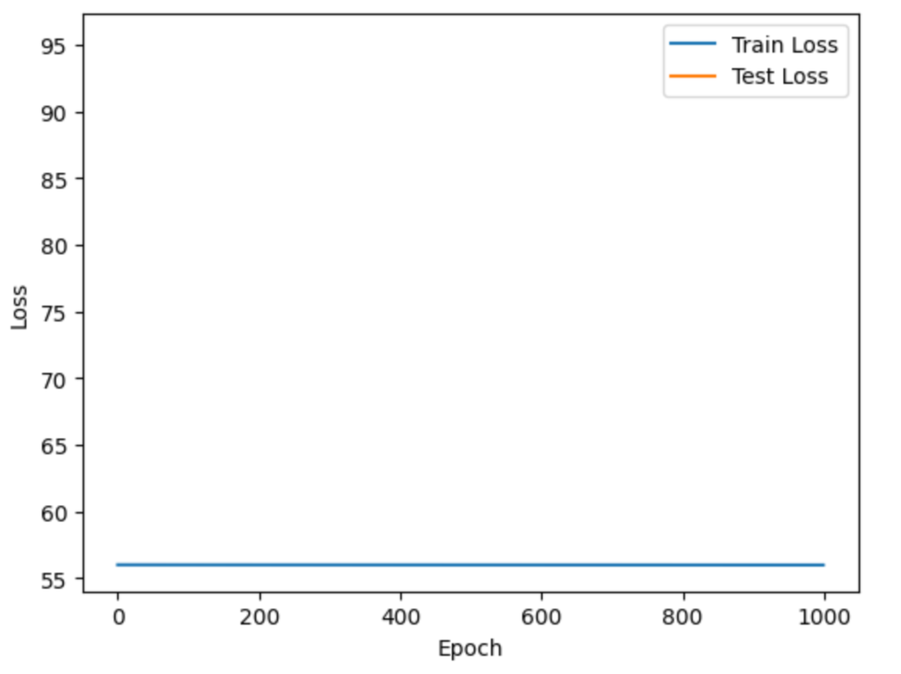
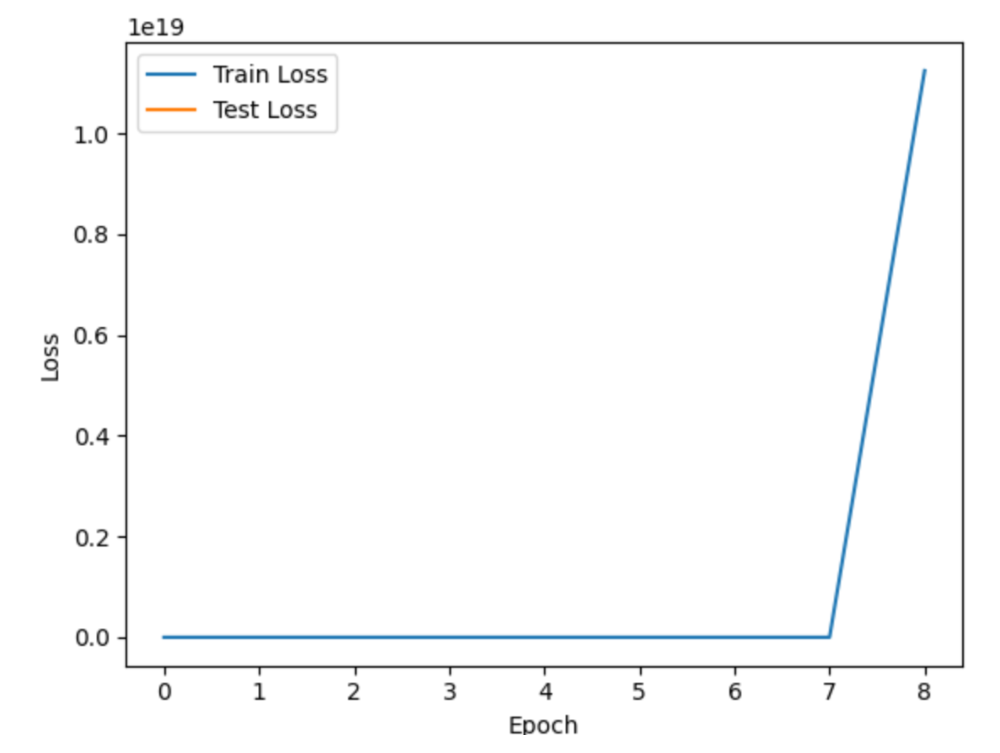
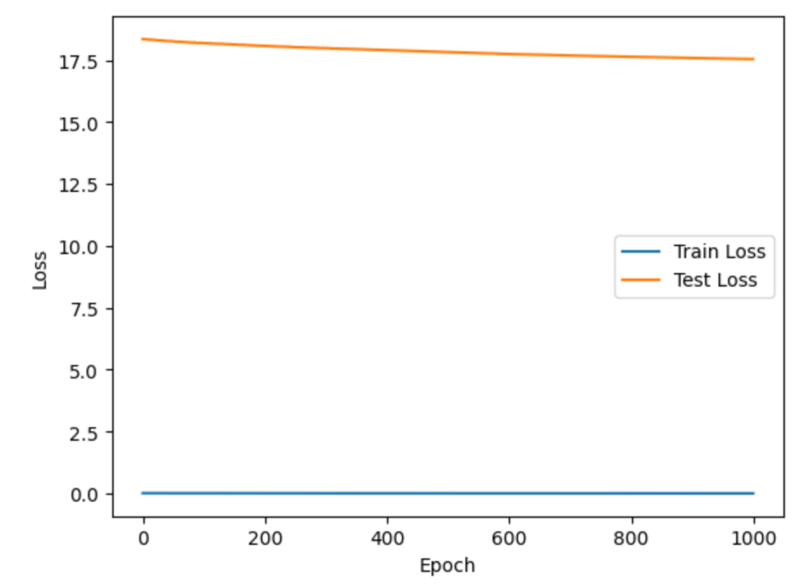
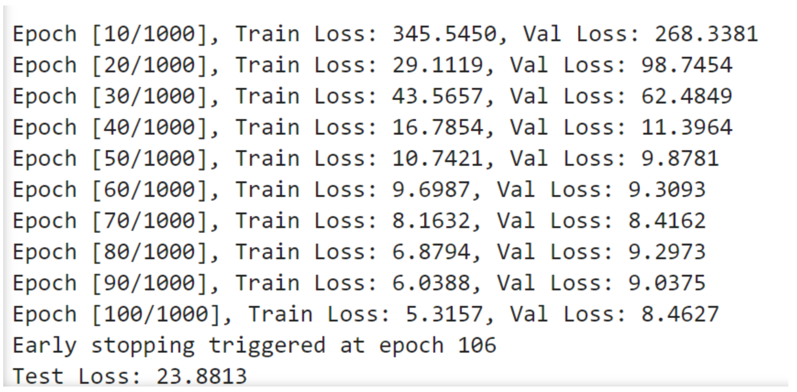
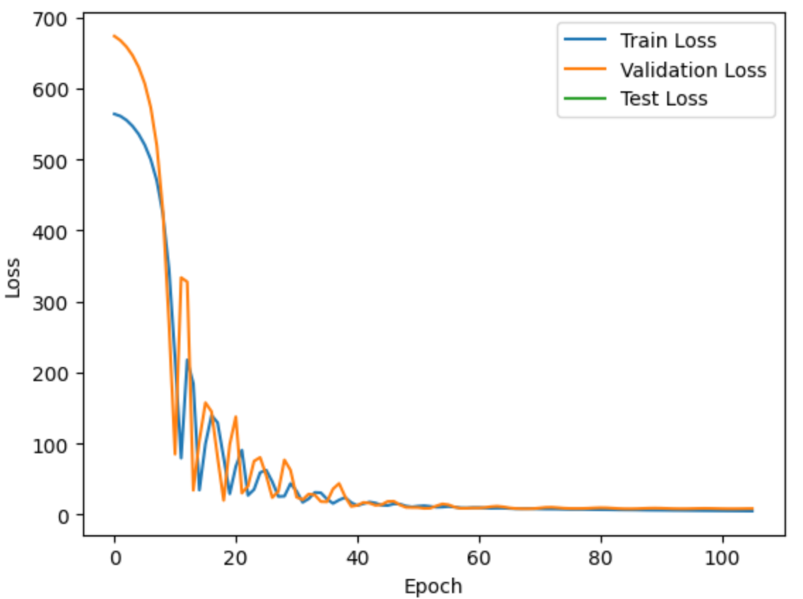
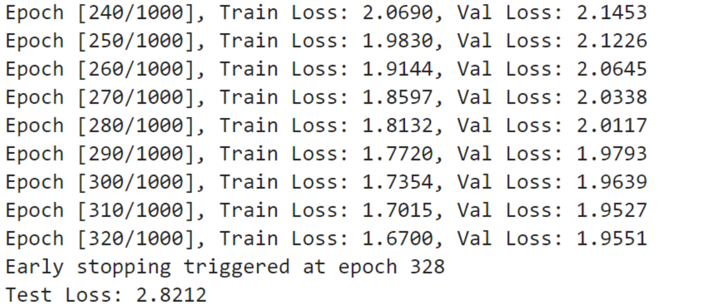
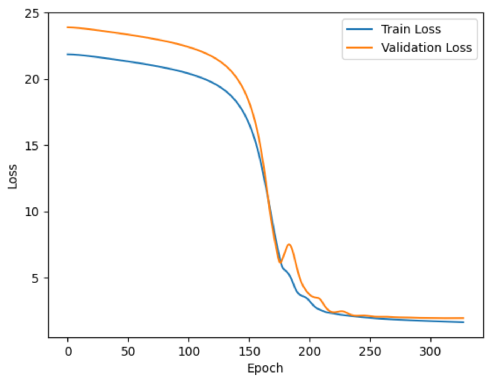

## 构建神经网络过程：

#### 数据预处理：

**1、加载数据集并划分：**

这里先把数据集划分为了0.8的训练集和0.2的测试集，然后在训练集里划分出0.1的验证集（最初没有理解训练集，测试集和验证集的概念，忽略了划分验证集）

`random_state=42` 确保数据集划分的可重复性，貌似选择42是个惯例

`X_train, X_test, y_train, y_test = train_test_split(X_dataset, y_dataset, test_size=0.2, random_state=42)`

`X_train, X_val, y_train, y_val = train_test_split(X_train, y_train, test_size=0.1, random_state=42)`

**2、对数据进行清洗，处理缺失值和异常值**

- 处理缺失值：
  - 了解到处理缺失值的方法有：删除包含缺失值的整行/列；用平均值/中位数/众数/固定值填充；
  - 本题使用X.fillna(X_train.mean(), inplace=True)  ,使用训练集的均值填充训练集验证集和测试集的缺失值。
- 处理异常值：
  - 了解到处理异常值的方法有：直接删除法；替换为最接近它的非异常值；通过标准化 Z-score（标准分数）来检测异常值，有异常的就删除。
  - 本题使用了Z-score 方法来检测并移除异常值：
    - 首先计算集合的Z-score：`z_scores_train =np.abs(stats.zscore(X_train))`
    - 移除 Z-score 大于 3 的异常值：`X_train_clean = X_train[(z_scores_train < 3).all(axis=1)]`
    - 同时移除对应的标签：`y_train_clean = y_train[X_train_clean.index]`

**3、对特征进行归一化处理**

- 归一化的目的是：转换为均值为 0，标准差为 1 的正态分布。使用scaler对三个集合归一化。
- 对训练集使用的方法是fit_transform(),这个方法是计算训练集的均值和标准差（`fit` 部分），然后根据计算的均值和标准差对训练数据进行转换（`transform` 部分），将每个特征转换为标准正态分布。
- 对测试集和验证集使用的方法是transform(),这个方法是不会重新计算均值和标准差，而是使用 训练集中计算出来的均值和标准差来转换测试集

#### 模型构建：

**1、设计一个适合回归问题的神经网络结构**

- 神经网络结构主要由三部分构成：输入层，隐藏层和输出层。
- 针对回归问题，隐藏层一般设计为全连接层+激活函数。本题中，我设计了3个隐藏层，每个激活函数使用的都是ReLu。
  - 由于本回归问题特征较为少，不需要太多的神经元学习更复杂的特征和模式，所以神经元最多只增加到了64个，数额选择过多可能会造成过拟合。
  - 选择relu这个激活函数是，感觉大部分都使用relu,如果要继续优化模型的话，可能会尝试使用不同的激活函数。

**2、选择合适的损失函数。**

criterion = nn.MSELoss()  

本题选用了均方误差函数，因为感觉好像回归问题都这么选，若效果不佳会尝试其他损失函数。

**3、选择合适的优化器**

optimizer = torch.optim.SGD(model.parameters(), lr=0.001, momentum=0.9)

本题选用了SGD的优化器，若效果不佳会尝试其他优化器。

#### 模型训练：

**1、前提准备**

- 设定训练次数，初始化训练损失和验证损失的记录
- 设定保存参数，保存损失最小模型的量和计数器

**2、训练过程**

- 训练模式：向前传播，反向传播和优化，记录训练损失。
- 验证模式：向前传播，记录验证损失；启动早停机制，保存最佳模型参数。
- 测试模型：只需测试一次，使用最优的模型进行测试

## （无验证集的情况下）问题和解决

由于在学习过程和练习代码中没有学到验证集，并且未认真阅读题目要求，导致在初始训练过程中没有用到验证集。后在写文档时发现验证集，遂学习并修改代码，并在文档中加上有验证集的部分。以下是在没有使用验证集的情况下的问题记录。

**1、问题：下载的数据集有三个文件，训练集和测试集已经划分好，但是测试集里没有目标值，目标值在submission里面。**

不清楚这种情况，不知如何评估，于是自己改写把submission里的值写进测试集。

然后发现，submission里的目标值都是一样的数，放到test里面经过异常检测后就全部被删除了。

最后决定舍弃测试集，从训练集里划分出一部分来进行测试。

**2、最初使用了64个神经元，2个隐藏层，优化器选取的SGD，结果不是很理想**

**改进**：使用了128个神经元，3个隐藏层

**现象**：出现了梯度爆炸

**过拟合了**

**再次改进：** 最多64个神经元，3个隐藏层，学习率为0.001。

效果看起来还可以。

## （加入验证集后）模型优化

加入验证集后，在以上的模型基础上进一步优化。

根据学习，我发现加入了验证集后感觉跟处理测试集没有什么区别。于是了解了验证集的一些用法，其中包括早停，超参数调优，保存损失最小的模型。

并且发现了我对于测试集的使用是错误的，测试集一般不需要循环测试很多遍，只需要找到最好的模型，或者是训练完了的模型进行测试一遍就好了（我貌似之间一直把测试集当验证集用）

#### 1、初始训练结果

**初始指标为**：3个隐藏层，学习率为0.001，损失函数为MSELoss,优化器为SGD

**结果显示**：在第106次的时候停止训练，此时模型达到最优结果。验证集和训练集的差别不大，能有效避免过拟合。测试集损失和训练损失差距较大但是在可接受范围内。

**问题**：验证集损失波动大，可能需要调小学习率；测试集表现不够理想，可能需要调整模型复杂度，或改变优化方法。

**接下来的改进：**学习使用学习率调度器，将损失函数改为SmoonthL1Loss(),这个损失函数适合波动较大的数据。

#### 第二次改进结果：

**改进内容**：增加了学习率调度器

`scheduler = torch.optim.lr_scheduler.ReduceLROnPlateau(optimizer, 'min', patience=5, factor=0.5)`

**效果**：更差

#### 第三次改进结果

**改进内容**：放弃使用学习调度器，改变损失函数 `criterion = nn.SmoothL1Loss()`

**结果：**这个损失函数减少了异常值的影响，效果好了很多；停止的次数多了，收敛速度变慢，说明在之前模型一直在减少损失，一直在优化。

